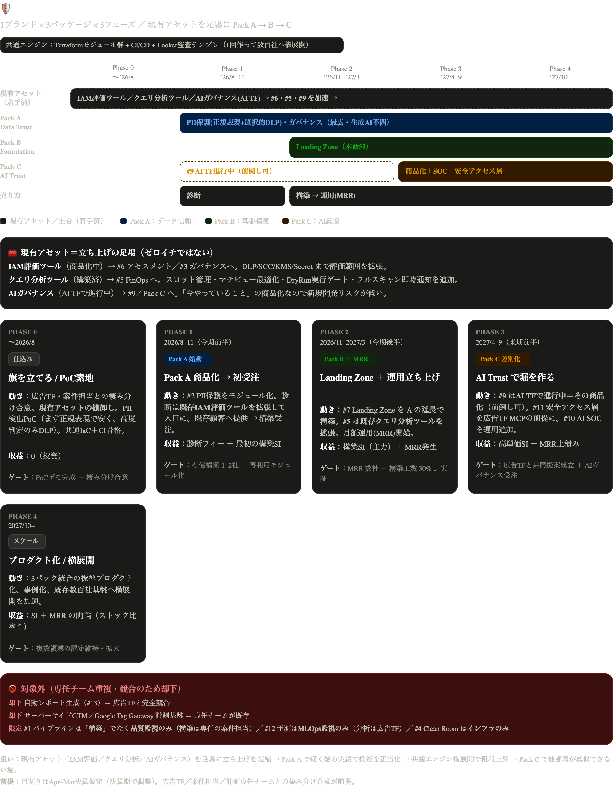

# Secure Data & AI Foundation — 事業ロードマップ（詳細版）

> 推奨構造「**1ブランド × 3パッケージ × 3フェーズ**」を時系列に落とし、**成果物・技術構成・価格・KPI・体制・月次マイルストーン**まで具体化したもの。
> 着手は **Pack A（PII保護）** から。共通IaCエンジンを育てながら B→C へ拡張する。
> ※ 月は 2026/06 起点（本日 2026-06-28）。**Apr–Mar決算を仮定**。決算期に合わせて月割りは要調整。
> ※ **価格・人月・売上の数値はすべて「例示値（要調整）」**。社内の標準単価・原価率に置き換えて使う。詳細な13アイデアの整理は [`ideas_new_services.md`](ideas_new_services.md) を参照。

______________________________________________________________________

## 全体像

```
 1つの旗（ブランド）: Secure Data & AI Foundation
   └ 共通エンジン: Terraformモジュール群 + CI/CD + Looker監査テンプレ（1回作って横展開）
        ├ Pack A: Data Trust（PII保護・ガバナンス・品質・コスト） … 最も広い入口・生成AI不問
        ├ Pack B: Foundation / Landing Zone（IaC一括構築）       … 本命SI
        └ Pack C: AI Trust（AIガバナンス・SOC・安全アクセス層）   … 差別化の堀・広告TF MCPの前提
   売り方（横串の3フェーズ）: 診断 Assess → 構築 Build → 運用 Operate(MRR)
```



**3つの数字で表す事業ゴール（例示・要調整）**

| 指標 | 今期末（2027/3） | 来期末（2028/3） |
|---|---|---|
| 構築SI 受注社数（累計） | 3〜5社 | 12〜18社 |
| MRR 契約社数 | 3社 | 10社 |
| 月次ストック収益（MRR） | ¥0.6M/月 | ¥3M/月 |
| モジュール再利用率（2社目以降の構築工数削減） | 30% | 50% |
| スペシャライゼーション実績 | Security 申請要件に到達 | Security 認定 + Data Analytics 申請 |

______________________________________________________________________

## 共通IaCエンジン（全パックの土台 — ここに最初に投資する）

「一度作って数百社に横展開」が最大の武器。各パックは**この単一リポジトリのモジュール合成**として表現する。

### リポジトリ構成（モノレポ）

```
secure-data-ai-foundation/
├── modules/                      # 再利用可能な Terraform モジュール（パックの部品）
│   ├── pii-protection/           # Pack A: DLP テンプレ / Dataplex プロファイル / マスキング /
│   │                             #         Authorized View / 列レベルアクセス / DSAR削除パイプライン
│   ├── access-governance/        # Pack A: IAM最小権限 / Row Access Policy / 列レベルセキュリティ /
│   │                             #         VPC-SC境界 / 監査ログSink / Data Catalog タグ
│   ├── data-quality/             # Pack A: GA4 export 鮮度・欠損・スキーマdrift検知 / Monitoringアラート
│   ├── finops/                   # Pack A: Budget / スロット予約 / カスタムコスト制御 / コストLooker
│   ├── landing-zone/             # Pack B: Project Factory / Org Policy / 共有VPC / Looker / Workbench
│   ├── ai-governance/            # Pack C: Gemini/Vertex usage export / プロンプトDLP /
│   │                             #         AI監査ログ(BQ) / 部署別ポリシーエンジン
│   └── ai-safe-access/           # Pack C: MCP/Agent/RAG ガードレール / BQクエリ上限・行数制限 /
│                                 #         マスク済ビュー経由のみ許可 / 全アクセス監査
├── blueprints/                   # 上記を合成した「パック」単位の参照アーキテクチャ
│   ├── pack-a-data-trust/
│   ├── pack-b-landing-zone/
│   └── pack-c-ai-trust/
├── policy/                       # Policy as Code（Org Policy / OPA(Conftest) / tfsec ルール）
├── ci/                           # WIF + Cloud Build / GitHub Actions（plan→policy→apply ゲート）
├── looker/                       # 監査・コスト・データ品質の LookML ダッシュボードテンプレ
└── examples/                     # 顧客最小構成のサンプル（PoC/デモ用）
```

### 技術スタック（GCP）

- **データ／統制**：BigQuery、Cloud DLP、Dataplex、Data Catalog、Authorized View、Row/Column-level Security
- **基盤／境界**：IAM、Org Policy、VPC Service Controls、KMS、Secret Manager、Cloud Asset Inventory、Security Command Center
- **可観測性**：Cloud Logging（BQ Sink）、Cloud Monitoring、Looker / Looker Studio
- **CI/CD**：GitHub Actions or Cloud Build、Workload Identity Federation、tfsec / Checkov / Conftest、Terraform（モジュール＋tfstate運用：GCSバックエンド＋ステートロック）
- **AI**：Vertex AI、Gemini、（Pack C）MCP/Agent ガードレール

### CI/CDパイプライン（全パック共通）

`PR → fmt/validate → tfsec/Checkov → Conftest(Policy as Code) → terraform plan（PRコメント） → 承認 → WIF経由 apply → 監査ログ/ドリフト検知`

> **設計原則**：①全部品はモジュール化し顧客別は変数だけで差し替え ②機密は Secret Manager + WIF（鍵レス）③Org Policy/VPC-SCはコード化し逸脱をCIで止める ④Looker監査テンプレは全パック共通で再利用。

______________________________________________________________________

## パッケージ定義（中身・成果物・価格・期間）

> 価格・期間は**例示値（要調整）**。「診断 → 構築 → 運用」の階段で必ずMRRに繋ぐ。

### 入口：Assess（診断）

| メニュー | 対応アイデア | 主な成果物 | 期間目安 | 価格（例示） |
|---|---|---|---|---|
| データ安全性診断（軽量・PII特化） | #2 | PII混入レポート（GA4 export内の実検出） + 改善提案 | 1〜2週 | ¥30〜80万 |
| AI Ready & BQ Governance Assessment（約100項目） | #6 | AI Ready Score + 改善ロードマップ + 構築見積 | 2〜3週 | ¥50〜150万 |

### Pack A — Data Trust（構築・本命の入口商品）

- **中身**：`pii-protection` + `access-governance` + `data-quality`（+ オプション `finops`）
- **成果物**：DLPスキャン自動化／マスキング済Authorized View／DSAR削除パイプライン／監査ログ集約／データ品質アラート／Looker監査ダッシュボード／Terraformコード一式の引き渡し
- **期間／価格（例示）**：横展開 3〜4週／初回 約6週 ｜ 構築 **¥350〜450万**（横展開時。+ DLPスキャン量に応じ請求代行売上が上乗せ）
- **紐付け**：Security スペシャライゼーション実績

### Pack B — Foundation / Landing Zone（構築SIの主力）

- **中身**：`landing-zone` を core に Pack A モジュールを内包。`GA4 → BigQuery → Looker → Vertex AI → Notebook → Agent` を安全に使える状態まで一括構築
- **成果物**：Project/IAM/Org Policy/共有VPC/Dataset/Authorized View/Row Access Policy/Data Catalog/DLP/Logging/Monitoring/Budget/SCC/Audit/Secret Manager/WIF/CI/CD/Policy as Code/Security Scan
- **期間／価格（例示）**：**横展開 3〜4週**（「安全に運用できる状態まで3週間」の訴求は横展開時）／**初回は6〜8週** ｜ 構築 **¥800〜1,200万**
- **紐付け**：Data Analytics / Infrastructure スペシャライゼーション実績

### Pack C — AI Trust（差別化の堀・広告TF MCPの前提）

- **中身**：`ai-governance` + `ai-safe-access`（+ 運用で AI SOC）
- **成果物**：AI利用可視化（誰が/どのモデル/いくら/どのデータ）／プロンプトDLP／AI監査ログ／部署別ポリシーエンジン／MCP・Agent・RAGガードレール／BQガードレール（マスク済ビュー経由のみ・クエリ上限・行数制限・インジェクション対策）
- **期間／価格（例示）**：「2週間でAI利用基盤」はスコープ限定・横展開時 ／ 初回は4〜6週 ｜ 構築 **¥1,000〜1,500万**
- **紐付け**：Security 本格認定／プレミアパートナー要件への寄与

### 運用：Operate（MRR・全パック横断）

| プラン | 内容 | 価格（例示・月額） |
|---|---|---|
| Standard | 監査監視・ドリフト検知・権限棚卸し・コスト分析・月次レポート | ¥15〜30万/月 |
| Advanced | + AI SOC（Prompt Injection/Shadow AI/流出検知）・SLA・インシデント対応 | ¥30〜50万/月 |

______________________________________________________________________

## 単価前提とユニットエコノミクス（人日 ¥10万 基準）

> **標準単価＝¥100,000/人日（8時間）**。本書では **1人月＝20人日＝¥200万** で換算する。
> この単価は **工数の金額換算（≒原価・見積の最低ライン）** として扱う。**販売価格はこの上に乗せる固定価格**とする。

### 価格設計の原則 ―― 構築は「人日精算」ではなく「固定価格」で売る

- 純粋な人日精算（工数 × ¥10万）にすると、**モジュール再利用で工数が減るほど売上も減り**、横展開の旨味（＝再利用率）が顧客側に流れてしまう。
- そこで **構築（Pack A/B/C）は固定価格（バリュー価格）** で販売する。工数削減分は**自社の粗利**に変わる。これが「一度作って横展開で粗利が跳ねる」を成立させる仕組み。
- **診断・スポット改修・運用（MRR）** は人日精算 or 固定のどちらでも可。

### ユニットエコノミクス①：横展開（2社目以降＝定常採算 ｜ 例示・要調整）

> 工数は **PM・打合せ・セキュリティレビュー等のオーバーヘッド込みの総工数**。モジュール開発（R&D）は下の別表で一度だけ計上する。

| メニュー | 横展開 工数(人日) | 原価(¥) | 推奨販売価格(¥) | 粗利率 |
|---|:---:|:---:|:---:|:---:|
| データ安全性診断（PII） | 5 | 50万 | 0〜80万 ※戦略的入口 | ▲〜+38% |
| AI Ready Assessment（100項目） | 7 | 70万 | 100〜150万 | 30〜53% |
| Pack A：Data Trust | 16 | 160万 | **350〜450万** | 54〜64% |
| Pack B：Landing Zone | 35 | 350万 | **800〜1,100万** | 56〜68% |
| Pack C：AI Trust | 40 | 400万 | **1,000〜1,400万** | 60〜71% |
| 運用 Standard（MRR） | 1.5/月 | 15万/月 | 25〜30万/月 | 40〜50% |
| 運用 Advanced（MRR） | 3/月 | 30万/月 | 45〜50万/月 | 33〜40% |

### ユニットエコノミクス②：初回エンゲージメント（1社目＝モジュール開発を兼ねる）

> 1社目は **横展開納品 ＋ モジュールR&D** が重なるため総工数が大きい。**R&Dは最初の2〜3社で償却**する前提で見る（その案件単体では薄利〜赤字）。

| パック | 初回納品(人日) | ＋R&D（採用＝CFT流用後） | 実質・初回一式 | 参考：圧縮前R&D |
|---|:---:|:---:|:---:|:---:|
| Pack A | 22 | 30 | 約52人日（≒¥520万） | 35 |
| Pack B | 45 | 40 | 約85人日（≒¥850万） | 65 |
| Pack C | 50 | 45 | 約95人日（≒¥950万） | 55 |

> **価格フロア**：横展開でも原価割れしないよう、Pack A ¥350万／B ¥800万／C ¥1,000万 を下限とする。1社目はR&Dを別枠（投資）で見るため、案件価格は横展開と同水準でよい（R&Dは複数社で回収）。

### 共通エンジンへの先行投資（一度だけ・非課金R&D ｜ 圧縮前 → 採用＝CFT/流用後）

| 投資項目 | 圧縮前(人日) | 採用(人日) | 採用額(¥) | 時期 |
|---|:---:|:---:|:---:|---|
| PoC + リポジトリ骨格（`pii-protection`/`ci`） | 20 | 18 | 180万 | Phase 0 |
| Pack A モジュール群 製品化 | 35 | 30 | 300万 | Phase 1 |
| `landing-zone`（CFT project-factory/secure-foundations 流用） | 65 | 40 | 400万 | Phase 2 |
| `ai-governance`/`ai-safe-access`（初回スコープ限定） | 55 | 45 | 450万 | Phase 3 |
| **合計** | **175** | **133** | **1,330万** | — |

> **流用方針（▲42人日の圧縮根拠）**：Pack B は Cloud Foundation Toolkit（project-factory・secure-foundations blueprint）をフォークし「分析特化Lite」に削る＝ゼロから作らない（▲25）。Pack C は初回スコープを「AI利用可視化＋監査ログ＋BQガードレール」に限定し、MCP/Agentガードレールは広告TFのMCP案件と共同構築に回す（▲10）。さらにパック間でCI/IAM/DLP/監査部品を流用。
> この投資は1回で全顧客に展開でき、**各パック横展開2〜3社で回収**できる。

### 今期 売上・粗利イメージ（実態工数版 ｜ 例示・保守シナリオ）

> 今期（〜2027/3）は **Pack A・B のみ**（Pack C は Phase 3＝来期）。受注ミックスの一例で、実際の受注数で再計算する。

| 区分 | 内訳（例） | 売上(¥) | 原価(¥) |
|---|---|:---:|:---:|
| 診断 | 4社 × 50万 | 200万 | 200万 |
| Pack A 構築 | 1社目400万 + 横展開2社 × 400万 | 1,200万 | 220 + 160×2 ＝ 540万 |
| Pack B 構築 | 1社目900万 + 横展開1社 800万 | 1,700万 | 450 + 350 ＝ 800万 |
| 運用(MRR) | 3社 × 25万 × 平均3ヶ月 | 225万 | 135万 |
| **外販 計** | | **約3,325万** | **約1,675万** |
| 外販粗利 | | **約1,650万（粗利率 約50%）** | |
| R&D先行投資（今期分・採用＝CFT流用後） | PoC180 + PackA300 + PackB400 | △880万 | |
| **投資後 利益（今期）** | | **約770万** | |

> **CFTを流用しない場合**：Pack B のR&Dが ¥400万→¥650万 になり、R&D計 ¥1,130万 → **投資後利益 約520万** に下がる。CFT流用が今期利益を ＋約250万 押し上げる＝「車輪の再発明をしない」が効く。
> 実態工数（重め）に直しても、**横展開の高粗利**で今期は黒字を維持。来期はR&Dが一巡し、横展開＋MRR積み上げで粗利率はさらに改善する。

______________________________________________________________________

## フェーズ別ロードマップ（月次マイルストーン・成果物・KPI・体制）

### Phase 0 — 旗を立てる / PoC素地（2026/07〜08・約1〜2ヶ月）

- **月次マイルストーン**
  - 07月：ブランド定義・広告TFとの棲み分け1枚資料を作成し**上司・広告TFリードと合意**。共通IaCリポジトリ初期化（`modules/pii-protection` と `ci/` の骨格）。
  - 08月：社内GA4/BQで **PII検出PoC** を実装（GA4 export の page_location/クエリパラメータからメール・トークン混入を実検出 → Looker可視化デモ化）。デモ動画/スライド完成。
- **成果物**：棲み分け合意メモ／PoCデモ（実データ検出）／IaCリポジトリ骨格＋CI雛形
- **収益**：¥0（投資フェーズ）
- **体制（例示）**：あなた 0.5人月／2ヶ月（既存業務と兼務）
- **ゲート**：PoCデモ完成 ＋ 社内棲み分け合意 ＋ DLP検出の説得力ある実例を1件確保

### Phase 1 — Pack A 最小商品化 → 初受注（2026/08〜11・今期前半）

- **月次マイルストーン**
  - 08〜09月：`pii-protection`/`access-governance`/`data-quality` をモジュール化。「データ安全性診断」メニュー化（提案書・見積テンプレ・診断スクリプト）。
  - 09〜10月：既存GAリセラー顧客 **3〜5社へ診断提供**（無償/低単価の入口）。1社目の構築見積提示。
  - 10〜11月：**Pack A 構築 1〜2社受注・納品**。納品物をテンプレ化し再利用率を測定。
- **成果物**：Pack A（Data Trust）提供開始／診断メニュー／再利用可能モジュール v1／顧客リファレンス1件
- **収益（例示）**：診断フィー（¥30〜80万 × 数社）＋ 最初の構築SI（¥150〜400万 × 1〜2社）
- **体制（例示）**：あなた 1人月/月 ＋ 既存リセラー営業 0.5（送客）
- **KPI / ゲート**：有償構築 **1〜2社受注** ＋ モジュール再利用率の計測開始 ＋ Security実績の起点1件

### Phase 2 — Pack B（Landing Zone）+ 運用MRR 立ち上げ（2026/11〜2027/03・今期後半〜今期末）

- **月次マイルストーン**
  - 11〜12月：`landing-zone` 完成、Pack A を内包する `blueprints/pack-b` 整備。1社目のLanding Zone構築着手。
  - 01〜02月：2社目以降をモジュール再利用で構築（**工数30%削減を実証**）。`finops` 追加。Looker監査テンプレ横展開。
  - 02〜03月：**運用サービス（MRR）提供開始**、Pack A/B顧客から **3社をMRR契約**へ転換。
- **成果物**：Pack B（Foundation/Landing Zone）／運用サービス（MRR Standard）／工数削減の実績データ
- **収益（例示）**：構築SI主力（¥400〜1,200万 × 2〜3社）＋ MRR発生（¥0.6M/月規模へ）
- **体制（例示）**：あなた 1人月/月 ＋ エンジニア +1（横展開・運用立上げ）
- **KPI / ゲート**：**MRR 3社** ＋ 横展開で構築工数 **30%以上削減**を実証 ＋ Data Analytics/Infrastructure 申請実績に前進

### Phase 3 — Pack C（AI Trust）で差別化・堀を作る（2027/04〜09・来期前半）

- **月次マイルストーン**
  - 04〜05月：`ai-governance` 商品化（今期テーマ「AI統制・監査・監視」の製品化）。「AI Governance Accelerator（2週間）」メニュー化。
  - 06〜07月：`ai-safe-access` を **広告TFのMCPサーバーの前提条件**として社内連携。最初の共同提案を組成。
  - 08〜09月：AI SOC を運用メニュー（MRR Advanced）に追加。広告TF案件との相互送客が回り始める。
- **成果物**：Pack C（AI Trust）／AI SOC運用メニュー／広告TFとの共同提案テンプレ
- **収益（例示）**：高単価SI（¥600〜1,500万）＋ MRR Advanced 上積み
- **体制（例示）**：あなた 1人月/月 ＋ エンジニア1 ＋ セキュリティ/SRE +1（MRR運用）
- **KPI / ゲート**：広告TF案件との**共同提案 成立** ＋ AIガバナンス受注 1件 ＋ Security 認定要件への寄与

### Phase 4 — スケール / プロダクト化（2027/10〜）

- **動き**：3パック横断の標準プロダクト化、リファレンス事例化、既存数百社基盤への横展開を加速。営業はパートナー営業と連携し「アジアNo.1 GAリセラーの全顧客」へ面で展開。
- **製品／収益**：3パック統合プロダクト ／ SI＋MRRの両輪でスケール（MRR比率上昇＝事業安定化）
- **スペシャライゼーション**：複数領域の認定維持・拡大、プレミアパートナー要件への積み上げ

______________________________________________________________________

## 収益モデルの推移（ストック化の設計）

- Phase 1：**診断 → 構築SI**（フロー収益中心）
- Phase 2：構築SI ＋ **MRR発生**（ストック化開始）
- Phase 3〜4：SI ＋ **MRR積み上げ**（ストック比率上昇＝事業の安定化）

```
収益構成イメージ（例示）
Phase1 |■■■■■ SI                         | MRR -
Phase2 |■■■■■■■ SI         |■■ MRR        |
Phase3 |■■■■■■ SI          |■■■■ MRR      |
Phase4 |■■■■■ SI           |■■■■■■■ MRR    |  ← ストック比率が逆転に向かう
```

______________________________________________________________________

## GTM・営業導線（既存リソースの活かし方）

1. **リード源＝アジアNo.1のGAリセラー既存顧客基盤**。「GA4をBQに入れている全顧客」が母集団。
1. **入口は低摩擦の診断**（#2 PII / #6 AI Ready）。「あなたのGA4データ、URLにメール混入していませんか？」という具体的フックでアポ獲得。
1. **診断 → 構築 → 運用の階段**で1社あたりLTVを最大化。請求代行売上（DLPスキャン量・基盤消費）も自然に上乗せ。
1. **横展開**：1社の納品物をモジュール化し、2社目以降は変数差し替えで短納期・高粗利。
1. **広告TFとの相互送客**：広告TFのMCP/Vertex AI Search案件には Pack B/C をセット提案、こちらの基盤顧客には広告TFの分析を送客。

______________________________________________________________________

## 広告TFとの連携接点（競合ではなく依存関係を作る）

| 広告TFの提案 | あなたが提供する「前提基盤」 | 接点パック |
|---|---|---|
| GA4自然言語分析 MCPサーバー | MCP/BQガードレール・監査（マスク済ビュー経由のみ・クエリ上限） | Pack C #11 |
| Vertex AI Search for Commerce | Landing Zone（IAM/VPC-SC/DLP/監査の安全基盤） | Pack B #7 |
| LTV分析・Meridian（MMM） | Data Clean Room（外部データを安全に仕入れるインフラのみ担当） | #4（分析は広告TF） |
| 売上/流入レポート分析 | データ品質監視（壊れない正しいデータの担保） | Pack A #1 |

> **役割分担の原則**：データの「活用・分析・示唆」は広告TF、その手前の「安全・適法・高品質・低コストな基盤」はあなた。応用層（#12予測/LTV・#13自動レポート）は**単独では持たず**、やるならMLOps基盤・モデル監視のインフラ部分のみ。

______________________________________________________________________

## スペシャライゼーション／パートナー要件への紐付け

- **Security**：#2,#3,#9,#10,#11（Pack A の統制 + Pack C 全体）
- **Data Analytics / Infrastructure**：#1,#4,#5,#7（Pack A 品質/コスト + Pack B）
- **（参考）Machine Learning**：#12（広告TFと共同時のMLOps部分のみ）

> 提案・社内稟議の際に「**この案件は◯◯スペシャライゼーションの実績になる**」と明記すると経営合意が取りやすい。
> ※ Google Cloud の認定は一般に「**認定資格保有者 + 顧客導入実績（リファレンス）数件 + 第三者審査**」が要件。**最新の必要実績数・条件はパートナー窓口で要確認**（本書では未確定値を断定しない）。

______________________________________________________________________

## 必要リソース・体制（例示）

| フェーズ | あなた | エンジニア | セキュリティ/SRE | 営業 |
|---|:---:|:---:|:---:|:---:|
| Phase 0 | 0.5人月/月 | — | — | — |
| Phase 1 | 1.0人月/月 | — | — | 0.5（既存リセラー営業） |
| Phase 2 | 1.0人月/月 | +1 | — | 0.5 |
| Phase 3 | 1.0人月/月 | 1 | +1 | 0.5〜1 |

> 工数換算：**1人月＝¥200万**（¥10万/人日 × 20人日）。例：Phase 2 のエンジニア人件費は あなた1 + エンジニア1 ＝ 月¥400万規模。構築の固定価格はこの工数原価を上回るよう設定する（上記ユニットエコノミクス参照）。

______________________________________________________________________

## リスクレジスタ（前提・リスクと対策）

| リスク | 影響 | 対策 |
|---|---|---|
| 広告TFとの領域衝突（特に Pack C / Clean Room） | 社内政治・案件重複 | Phase 0で棲み分け1枚資料を合意。Clean Roomは「インフラのみ担当」を明文化。Pack Cは「MCPの前提条件」と位置づけ依存関係化 |
| エンタープライズの商談サイクルが長い | Pack B/C の売上が後ろ倒し | まず #2 PII を「軽い入口商品」で回し、#6→#7→運用へ育てる |
| FinOps（#5）が請求代行と利益相反 | コスト削減＝自社収益減 | 収益の柱にせず「信頼・リプレイス防止」の付加価値として位置づけ |
| 実装/営業リソース不足 | ロードマップ遅延 | Pack A から軽く始め、実績で投資を正当化。モジュール再利用率をKPI化し横展開で工数圧縮 |
| 法規制（改正個人情報保護法/GDPR）解釈 | 提案の信頼性 | 診断は「検出・技術対応」に限定し、法的判断は顧客/専門家に委ねる旨を明記 |
| 決算期による月割りズレ | 計画と実績の乖離 | Apr–Mar仮定。実決算期で月割りを再調整 |

______________________________________________________________________

## 直近90日アクションプラン（2026/07〜09・着手リスト）

> Phase 0 → Phase 1 序盤までの実行タスク。最小投資で「刺さるデモ」と「最初の受注」を作る。

- [ ] **棲み分け合意**：ブランド定義 + 広告TFとの境界1枚資料を作成し、上司・広告TFリードに合意を取る（07月上旬）
- [ ] **リポジトリ初期化**：`secure-data-ai-foundation` モノレポ作成、`modules/pii-protection` と `ci/`（WIF + plan/policy/apply）骨格をコミット（07月）
- [ ] **PII検出PoC**：社内GA4 export を Cloud DLP でスキャンし、URL/クエリパラメータのメール・トークン混入を実検出 → Looker Studio でヒートマップ可視化（07〜08月）
- [ ] **デモ化**：上記を5分のデモ動画＋提案スライドにまとめる（「あなたのGA4にメールが混入しています」フック）（08月）
- [ ] **診断メニュー整備**：「データ安全性診断」の提案書・見積テンプレ・診断スクリプトを作成（08月）
- [ ] **モジュール化**：`access-governance`・`data-quality` を Pack A として `blueprints/pack-a` に合成、`examples/` に最小構成サンプル（08〜09月）
- [ ] **初回営業**：既存GAリセラー顧客から **3〜5社**を選定し診断提供、1社目の構築見積を提示（09月）
- [ ] **計測の仕込み**：構築工数・再利用率・診断→構築転換率を測る簡易ダッシュボードを用意（09月）

______________________________________________________________________

詳細な13アイデアの背景・各AIの主張トレースは [`ideas_new_services.md`](ideas_new_services.md) を参照。
