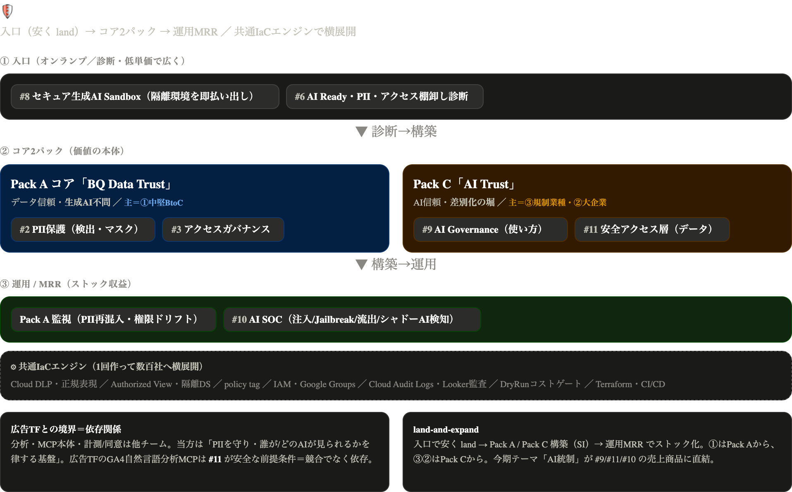

# 製品体系 全体まとめ — Secure Data & AI Foundation

> 深掘り済みアイデアを1つの製品体系に統合した、経営・上司向けの整理。
> 関連資料 — 13案カタログ [`ideas_new_services.md`](ideas_new_services.md)／採算と3フェーズ [`roadmap.md`](roadmap.md)／意思決定ログ [`ideas/_worklog.md`](ideas/_worklog.md)。
> 作成 2026-06-28。価格は 2026-06-29 改定済み（D18）：中堅BtoC の稟議予算帯 ¥100〜300万/件 に合わせ、Pack A は分割販売・入口は無償診断基本・Pack B は参入価格の2段構え。

**コード凡例** — 番号は製品構造で読めるように振ってある。`E=入口／A=Pack A（DSPM）／B=Pack B（AI-SPM）／X=控え・対象外`。〔#n〕はカタログ／意思決定ログ用の元ID。本文では役割コードのみ使う。

| E＝入口 | A＝Pack A（DSPM） | B＝Pack B（AI-SPM） | X＝控え・対象外 |
|---|---|---|---|
| E1 Sandbox〔#8〕 | A1 PII保護〔#2〕 | B1 制御・AIガバナンス〔#9〕 | X1 Landing Zone〔#7〕 |
| E2 診断〔#6〕 | A2 アクセス統制〔#3〕 | B2 データ強制・安全アクセス〔#11〕 | X2 Clean Room〔#4〕 |
| | A3 データ品質監視〔#1〕※運用に内包 | B3 ループ強制〔#14〕 | X3 予測MLOps〔#12〕 |
| | A4 FinOps〔#5〕※部品化・単体は控え | B4 検知対応・Managed AI-DR〔#10〕※月額運用で提供 | X4 自動レポート＝却下〔#13〕 |

> **命名変更（2026-06-29・D17）**：AI Trust は旧 Pack C → Pack B に改称。旧 Pack B＝Landing Zone は「Pack」呼称を廃止し X1（控え）に統一。過去資料・意思決定ログの「Pack C」は現 Pack B を指す。

______________________________________________________________________

## 0. エグゼクティブサマリ

広告TFが「データを使って分析する」のに対し、私たちは「データとAIを安全に使える土台」を売る。領域は重ならない。売る相手は、すでに GA4 と BigQuery を使っている既存顧客。商品は2本柱。

- **Pack A ＝ DSPM**（Data Security Posture Management＝データの安全姿勢管理）の BigQuery/GA4 特化版。生成AIを使っていない顧客にも刺さるので、全顧客が対象になる。
- **Pack B ＝ AI-SPM**（AIの安全姿勢管理）。新興カテゴリで競合が薄く先行できる。今期テーマ「AI統制」がそのまま売上商品になる。

この2本柱に、安く始められる入口（Sandbox・無償診断）と、毎月の運用収益を組み合わせる。共通の自動構築基盤を一度作れば多数の顧客へ横展開でき、利益率が高い。CNAPP（Wiz/Prisma/SCC 等のクラウド総合セキュリティ）とは競合せず、CNAPP が手薄な「BQ の深いデータ文脈」と「AIランタイム」を GCP 特化で補完する。

> 一言 — 広告TFがAIで“分析”するなら、私はデータとAIを“安全・適法・低コストに動かす土台”を量産する。

______________________________________________________________________

## 1. 製品体系（全体マップ）

商品は「入口 → 構築 → 運用」の3階層に並ぶ。すべて共通の自動構築基盤（Terraform モジュール群）の上に乗る。

| 階層 | 商品 | 対象 | 価格帯 | 収益の型 |
|---|---|---|---|---|
| 入口 | E1 Sandbox ／ E2 診断 | AIをこれから試す層・全セグメント | 無償〜100万円 | 月額（小）・単発 |
| 構築 | **Pack A**（A1＋A2） | 中堅BtoC（生成AI不問） | 1ステップ 80〜220万円 | 一括 |
| 構築 | **Pack B**（B1〜B3） | 規制業種・大企業 | 1階層 200〜800万円 | 一括＋月額 |
| 運用 | Standard（Pack A監視＋A3）／ Advanced（B4） | 構築済み顧客 | 月10〜40万円 | 月額 |

読み方 — 入口で安く接点を作り、Pack A か Pack B を構築で納め、月額運用に転換して継続収益にする。

______________________________________________________________________

## 2. パッケージ定義

### 入口 ── 安く広く接点を作る

| 商品 | 何をする | 価格 |
|---|---|---|
| E1 Sandbox | 生成AIを安全に試せる隔離環境を数分で払い出す。VPC-SC で隔離・Cloud DLP で個人情報検出・監査ログ・予算上限・自動期限切れつき | 月8〜15万円／環境 |
| E2 無償スクリーニング診断 | 個人情報の混入と過剰権限を自動スクリプトで検査し、1枚のレポートに | 無償（自動版のみ・既存顧客限定） |
| E2 詳細診断 | 手動分析で深掘りし、改善ロードマップと構築見積まで | 30〜50万円 |
| E2 AI Ready 診断 | 約100項目でAI導入の準備度を採点（規制業種・大企業向け） | 50〜100万円 |

______________________________________________________________________

### Pack A「BQ Data Trust ＝ DSPM for BigQuery」── 今期の主力

対象は中堅BtoC。生成AIを使っていなくても刺さる。個人情報保護法と監査対応は "やる/やらない" 以前の必須課題で、予算が付きやすい。

**コア構成** — 2つをステップ販売する。稟議が通る単位（1件 80〜220万円）に分割してあるのがポイント。

| 構成（提供順） | 役割 | カバー範囲 | 価格 |
|---|---|---|---|
| A1 PII保護 | 個人情報を見つけてマスクする | リスク採点・データ系譜（流れの地図化）・GA4特化の検出 | 80〜180万円 |
| A2 アクセス統制 | 誰がどのデータを見られるかを制御する | 実効アクセス分析・過剰権限の削減（CIEM for BQ） | 150〜220万円 |

**拡張（A3・A4）** — コアには入れず、次の形で提供する。

| 拡張 | 位置づけ |
|---|---|
| A3 データ品質監視 | 単体では売らない。**月額運用 Standard に内包**（GA4 export の欠損・遅延・スキーマ変化の監視） |
| A4 FinOps | クエリコスト制御の部品は **Pack B のガードレール（B2/B3）に吸収済み**。単体のコスト最適化サービスは控え——請求代行と利益がぶつかるため収益の柱にしない |

**売り方**

| 項目 | 内容 |
|---|---|
| 流れ | 無償診断 → A1 → A2 → 月額運用。分割販売が基本 |
| 一括オプション | A1＋A2 まとめて 300〜400万円 |
| 月額運用 | 10〜18万円（複数社共有の監視基盤で成立。下記の運用 Standard） |
| パートナー認定 | Google Cloud「Security スペシャライゼーション」取得に必要な導入実績としてカウントされる |

______________________________________________________________________

### Pack B「AI Trust ＝ AI-SPM」── 差別化の堀

対象は金融・医療など規制の固い業種と大企業。AI利用を4つの階層で固める。広告TFのAI検索・MCPを安全に動かす前提になるため、社内でも競合ではなく依存関係になる。

**4階層の構成** — B1〜B3 は構築で納品し、B4 だけは月額の運用サービスとして提供する。

| 階層 | 役割 | 主な機能 | 提供形態と価格 |
|---|---|---|---|
| B1 制御 | AIの使い方を統制する | AI/エージェントの棚卸し・リスク採点・ポリシー | 構築 500〜800万円 |
| B2 データ強制 | AIがデータに触れる瞬間の安全弁 | 出力検査・目的制限・アクセス遮断 | 構築 350〜600万円 |
| B3 ループ強制（新） | 自律エージェントの暴走を止める | 緊急停止・予算上限・人手承認 | 構築 200〜400万円＋月額20〜40万円 |
| B4 検知・対応 | 危険を検知し、B3/B2 と連携して実際に止める | Managed AI-DR（脅威検知→自動対応→月次レポート） | **月額運用**（下記 Advanced）。初期 150〜300万円＋月25〜40万円 |

**売り方**

| 項目 | 内容 |
|---|---|
| 価格の考え方 | 2段構え。新カテゴリで実績がまだ無いため、初期は上記の参入価格で実績を取り、リファレンス獲得後に段階的に引き上げる |
| パートナー認定 | 「Security スペシャライゼーション」の中核実績になり、プレミアパートナー要件にも効く |

______________________________________________________________________

### 運用 ── 月額メニュー（構築後の継続収益）

構築した基盤を見張り続けるサービス。ここがストック収益の柱になる。

| プラン | 中身 | 対象 | 価格 |
|---|---|---|---|
| Standard | Pack A の監視（PII再混入・権限ドリフト）＋ A3 データ品質監視 ＋ 月次レポート | Pack A 導入済み | 月10〜18万円 |
| Advanced ＝ B4 | Managed AI-DR。AIの危険な使われ方（乗っ取り・情報持ち出し・暴走）を検知し、B3/B2 と連携して止める。脅威分類は業界標準（OWASP Top10 for LLM／MITRE ATLAS）に準拠 | Pack B 導入済み | 初期150〜300万円＋月25〜40万円 |

> B4 は「Pack B の4階層のひとつ」であると同時に「その提供形態が月額運用」——構築物の納品ではなく、当方が運用を担うマネージドサービス。

______________________________________________________________________

## 3. 共通基盤アーキテクチャ ── モジュール再利用による原価優位

同じ部品が複数のパックで効く。一度作れば、2件目以降は設定を変えるだけで早く安く納品でき、利益率が上がる。

| 共通部品 | E1 | A1 | A2 | B1 | B2 | B3 | B4 |
|---|:--:|:--:|:--:|:--:|:--:|:--:|:--:|
| Cloud DLP / 正規表現 | ○ | ◎主 | ○ | ◎ | ○ | ○ | ○ |
| Authorized View | — | ◎ | ◎ | — | ◎ | — | — |
| policy tag | — | ○ | ◎ | ○ | ○ | — | — |
| IAM・Google Groups | ○ | ○ | ◎主 | ○ | ◎ | ○ | — |
| Cloud Audit Logs / Looker監査 | ○ | ○ | ◎ | ◎ | ◎ | ◎ | ◎主 |
| DryRun コストゲート | ○ | — | — | — | ◎ | ◎ | — |
| Terraform / CI/CD | ◎ | ◎ | ◎ | ◎ | ◎ | ◎ | ◎ |

> 列は「自身の永続的な構築物（Terraformでデプロイし残るリソース）を持つ商品」に絞った。E2 診断はこの表に無いが、既存モジュールを一時的に読みに行くだけで自分の構築物を持たないため対象外（A1・A2の検出/権限ロジックをスキャンに流用するのみ）。A3・A4 が無いのは、A3 が運用 Standard に内包、A4 が部品化して B2/B3 に吸収されている（単体は控え）ため。A4 由来のコスト制御は上の「DryRun コストゲート」行として登場している。

連携の強み — Cloud DLP の検出結果が、そのまま policy tag による閲覧制御と B2 のガードレールに渡り、さらに監視へ自動でつながる。検出から統制、運用までが一本の流れになる。

______________________________________________________________________

## 4. 販売戦略（Land and Expand）

入口で安く導入してもらい、コアの構築、毎月の運用へと広げ、1社あたりの取引額を最大化する。入口は薄利でも、構築と運用で回収する。請求代行の利用額も自然に増える。

| セグメント | 導入の流れ |
|---|---|
| 中堅BtoC | 入口 → **Pack A** → AIを本格化したら Pack B → 運用 |
| 規制業種 | 診断 → **Pack B** → 運用 Advanced → Pack A |
| 大企業 | 診断や入口 → **Pack A と Pack B** → 運用 |
| 広告TFのAI案件 | B2 を安全層として一緒に納品 → B1 → 運用 |

______________________________________________________________________

## 5. 広告TF・隣接チームとの境界 ── 競合ではなく依存

| 隣接チームの提案 | 私たちが提供する前提の土台 | 接点 |
|---|---|---|
| 広告TF — GA4を自然言語で分析するMCP | B2 安全アクセス層。AIは Authorized View 越しにだけ触れ、クエリの費用と件数に上限、危険な操作は遮断、すべて監査ログに記録 | Pack B |
| 広告TF — AI検索や分析 | B1 のAI統制と、安全に動かす実行基盤 | Pack B |
| 広告TF — LTVやMeridian分析 | 分析は広告TF。私たちは外部データを安全につなぐ土台だけ | 控え |
| 案件担当 — GA4→BigQuery のパイプラインとデータマート構築 | 構築は案件担当。私たちはそのデータの保護とアクセス統制 | Pack A |
| 計測・タグ専任チーム — サーバーサイドGTM、Google Tag Gateway | 対象外。計測と同意の入口には踏み込まない | — |

原則 — 分析や、計測・同意の入口は他チーム。その間の「安全に貯めて統制する」部分が私たちの担当。

______________________________________________________________________

## 6. 採算

- 構築の一括収入と、運用の月額収入の収入源が2種類ある。
- 構築は固定価格で売り、部品を使い回して工数が減るほど利益が残る。
- 価格改定（D18）の帰結 — 中堅BtoCの買える価格に下げた結果、今期は投資年（▲650万円規模）。来期に横展開の自動化・月額の積み上げ・Pack B の高単価で黒字化する。「今期＝商品化投資、来期＝回収」のストーリーで説明する。
- 月額収入の柱は、運用 Standard（Pack A監視＋A3）と Advanced（B4 Managed AI-DR）。単発収入から継続収入へ移し、事業を安定させる。
- 請求代行との相乗効果 — Cloud DLP のスキャン量や基盤の利用が Google Cloud の利用額を押し上げ、リセラー収益にも効く。
- パートナー認定 — 全パックが Google Cloud「Security スペシャライゼーション」の導入実績になり、プレミアパートナー要件に積み上がる。

______________________________________________________________________

## 7. ロードマップ反映

詳細な月割りと採算は [`roadmap.md`](roadmap.md)。

- **Phase 1 — 今期前半**
    - 投入 — Pack A と入口診断
    - 狙い — 中堅BtoCの既存客で最速の実績づくり、横展開できる部品化
- **Phase 2 — 今期後半**
    - 投入 — Pack A を横展開、月額運用 Standard、E1 Sandbox を入口に追加
    - 狙い — 継続収入のはじまり、工数3割削減の実証、裾野を広げる
- **Phase 3 — 来期**
    - 投入 — Pack B（B1 制御 → B2 データ強制 → B3 ループ強制）と広告TF連携、運用 Advanced（B4）
    - 狙い — 差別化の堀、規制業種・大企業の高単価、月額上位プランの積み上げ

B1 はAI TFで進行中なので前倒しできる。E1 は軽いので早い段階の入口に置ける。

______________________________________________________________________

## 8. 現状サマリ

- 仕様化済み — Pack A のコア（A1・A2）、Pack B の4階層（B1〜B4）、入口（E1）。中身・構成・成果物まで確定し、市場カテゴリ（DSPM/AI-SPM）への載せ替えも反映済み（worklog §2H/§2I）。
- 位置づけ確定 — A3 は運用 Standard に内包、A4 は部品として Pack B に吸収し単体は控え。
- 残り — 広告TF・案件担当との担当範囲の文書化。価格は D18 で確定（分割販売・入口無償・Pack B 2段構え）。実受注データが貯まったら見直す。
- 控え — X1 大企業向けフル基盤（Landing Zone）、X2 データ連携（Clean Room）、X3 予測MLOps。必要なときに展開。

詳細な意思決定ログは [`ideas/_worklog.md`](ideas/_worklog.md)。
